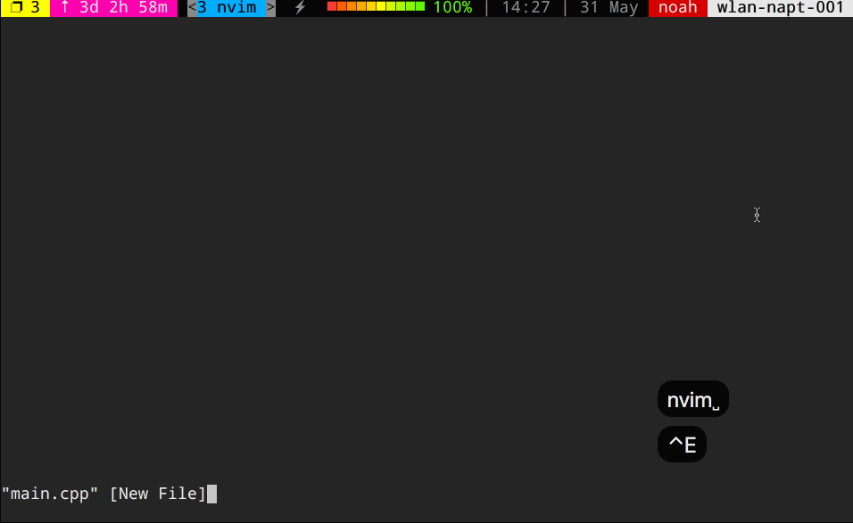

## yoshinani.vim


## installation
if you use `dein.vim`, 
```vim
call dein#add('NoahOrberg/yoshinani.vim')
```
if you use `NeoBundle.vim`, 
```vim
NeoBundle 'NoahOrberg/yoshinani.vim'
```

## usage



### template DIR
default template DIR is `$HOME/.yoshinani/`.  
you can set default template DIR.
``` vim
let g:yoshinani_template_path = '/path/to/template-dir'
```

### load template
``` vim
:Yoshinani
```

if this operation is troublesome, you can set `nnoremap`
``` vim
nnoremap <silent><C-y> :Yoshinani<CR>
```

### how to write template
#### e.g, C++ template
```c
#include <iostream>

using namespace std;

int main()
{
    {{{c}}}
    return 0;
}
```

Please write as you like according to the language.

#### control character
|control char|description|
|:-|:-|
|{{{c}}}|cursor position|
